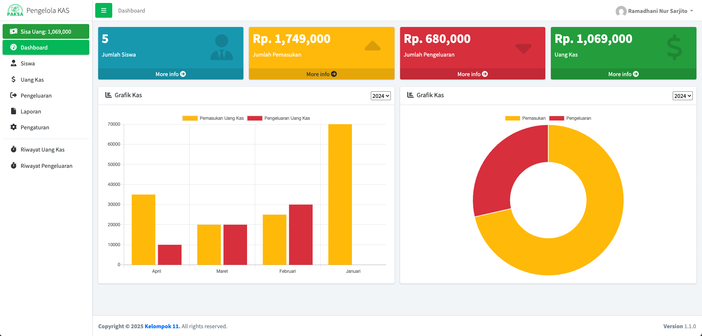

<p align="center">
  <a href="#">
    
  </a>
</p>

<h1 align="center">PaKSa – Manajemen Uang Kas Kelas</h1>

<p align="center">
  Aplikasi web untuk mengelola uang kas kelas: siswa, iuran, dan pengeluaran.
  <br/>
  <a href="#penggunaan"><strong>Lihat cara penggunaan »</strong></a>
  <br/>
  <br/>
  <a href="#instalasi">Instalasi</a>
  ·
  <a href="#kontribusi">Kontribusi</a>
  ·
  <a href="#lisensi">Lisensi</a>
</p>

---

## Daftar Isi
- [Deskripsi](#deskripsi)
- [Fitur](#fitur)
- [Tech Stack](#tech-stack)
- [Instalasi](#instalasi)
  - [Prasyarat](#1-prasyarat)
  - [Clone & Dependensi](#2-clone--dependensi-opsional)
  - [Database](#3-setup-database)
  - [Konfigurasi Aplikasi](#4-konfigurasi-aplikasi)
  - [Variabel Lingkungan](#5-variabel-lingkungan-env)
  - [Jalankan Lokal](#6-jalankan-lokal)
- [Penggunaan](#penggunaan)
- [Akun Demo](#akun-demo)
- [Tangkapan Layar](#tangkapan-layar)
- [Struktur Proyek](#struktur-proyek)
- [Kontribusi](#kontribusi)
- [Lisensi](#lisensi)
- [Ucapan Terima Kasih](#ucapan-terima-kasih)

## Deskripsi
<p align="center">
  
  <br/>
</p>

PaKSa adalah aplikasi web untuk mengelola uang kas kelas. Fitur utama mencakup pengelolaan data siswa, penjadwalan pembayaran bulanan (per minggu), pencatatan pengeluaran, rekapitulasi di dashboard, serta pembuatan laporan. Ditujukan untuk bendahara/administrator kelas agar pencatatan lebih rapi dan efisien.

## Fitur
- Manajemen data siswa (CRUD)
- Pengaturan dan pelacakan pembayaran bulanan per minggu
- Rekap pemasukan dan pengeluaran pada dashboard
- Pencatatan pengeluaran disertai riwayat
- Laporan pemasukan per bulan dan pengeluaran berdasarkan rentang tanggal
- Autentikasi dengan Google reCAPTCHA v2 (Checkbox)
- URL rapi melalui `.htaccess`

## Tech Stack
<p>
  <a href="https://www.php.net/"></a><br/>
  <a href="https://codeigniter.com/"></a><br/>
  <a href="https://www.mysql.com/"></a><br/>
  <a href="https://adminlte.io/"></a><br/>
  <a href="https://getbootstrap.com/"></a><br/>
  <a href="https://jquery.com/"></a><br/>
  <a href="https://www.chartjs.org/"></a><br/>
  <a href="https://www.google.com/recaptcha/about/"></a>
</p>

## Instalasi
### 1) Prasyarat
- PHP 7.4+ (disarankan 8.x)
- MySQL
- Composer (opsional)
- (Contoh untuk macOS menggunakan Homebrew)

### 2) Clone & dependensi (opsional)
```bash
# macOS
brew install php composer

# Clone repo
git clone https://github.com/<kamu>/paksasite.git
cd paksasite

# Opsional (default tidak menggunakan vendor)
composer install
```

### 3) Setup database
```bash
# Buat database dan import skema+seed
# phpMyAdmin atau mysql CLI
# Contoh (CLI):
# mysql -u root -p -e 'CREATE DATABASE kas CHARACTER SET utf8mb4 COLLATE utf8mb4_general_ci;'
# mysql -u root -p kas < kas.sql
```
Edit `application/config/database.php` sesuai kredensial:
```php
$hostname = '127.0.0.1';
$username = 'root';
$password = '';
$database = 'kas';
```

### 4) Konfigurasi Aplikasi
- `application/config/config.php`
  - `base_url` = `http://localhost:8000/`
  - `index_page` = '' (kosong) agar URL bersih
- Izin tulis folder:
```bash
mkdir -p application/cache/sessions
chmod -R 755 application/cache application/cache/sessions application/logs
```

### 5) Variabel Lingkungan (.env)
Buat file `.env` di root proyek (sejajar `index.php`):
```env
CI_ENV=development
RECAPTCHA_SITE_KEY=site-key-kamu
RECAPTCHA_SECRET=secret-key-kamu
```
- Tambahkan domain (`localhost` saat dev) di Google reCAPTCHA Admin Console (v2 Checkbox).

### 6) Jalankan Lokal
```bash
php -S localhost:8000 -t /Users/<kamu>/projects/paksasite
# buka http://localhost:8000
```

## Penggunaan
- Masuk via halaman Sign In → akses dashboard untuk ringkasan.
- Tambahkan periode bulan, catat pembayaran mingguan, dan input pengeluaran.
- Buat laporan (pemasukan per bulan atau pengeluaran per rentang tanggal).

Tip: Jika reCAPTCHA menampilkan “Invalid site key”, pastikan kunci v2 Checkbox benar dan domain sudah terdaftar di konsol reCAPTCHA.

## Akun Demo
- **Username**: `rama09n`
- **Password**: `goes0000`

## Struktur Proyek
```
.
├─ application/
│  ├─ config/           # Konfigurasi CI (base_url, database, sessions)
│  ├─ controllers/      # Controller MVC (Login, Register, Dashboard, dll.)
│  ├─ models/           # Logika bisnis/akses data
│  └─ views/            # View PHP (UI AdminLTE)
├─ assets/              # CSS, JS, AdminLTE, plugin, gambar
├─ system/              # Core CodeIgniter
├─ upload/              # Upload pengguna (di-ignore Git secara default)
├─ kas.sql              # Skema database + data awal
├─ .htaccess            # Rewrite URL ke index.php (URL rapi)
└─ index.php            # Front controller + loader .env
```

## Kontribusi
1. Fork repository dan buat branch baru.
2. Lakukan perubahan dengan commit message yang jelas.
3. Pastikan tidak ada secret yang ter-commit (gunakan `.env`).
4. Buka Pull Request dengan deskripsi singkat dan lampirkan screenshot bila perlu.

## Lisensi
MIT License.

## Ucapan Terima Kasih
- Struktur README terinspirasi oleh Best-README-Template: [github.com/othneildrew/Best-README-Template](https://github.com/othneildrew/Best-README-Template?utm_source=chatgpt.com)